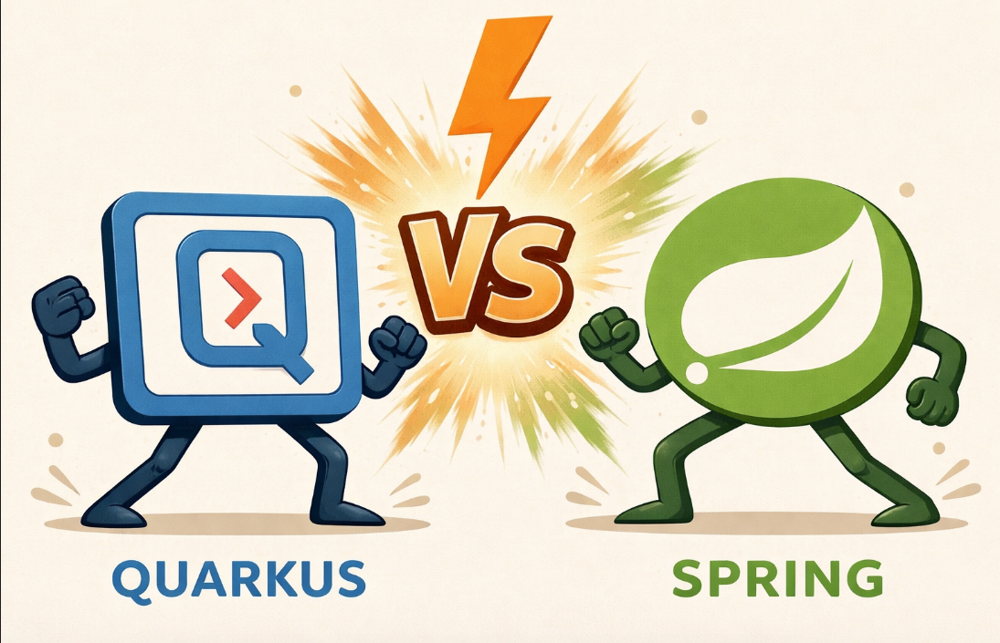
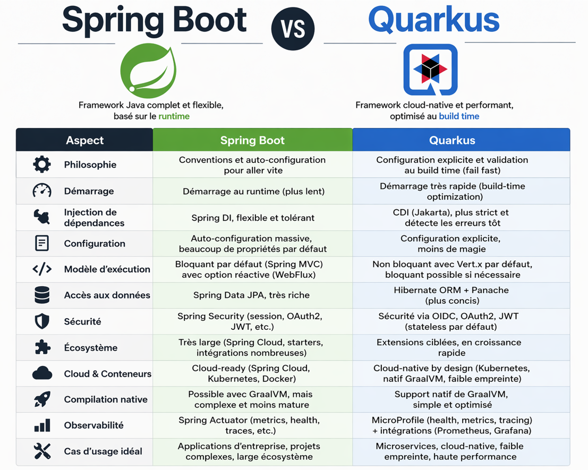
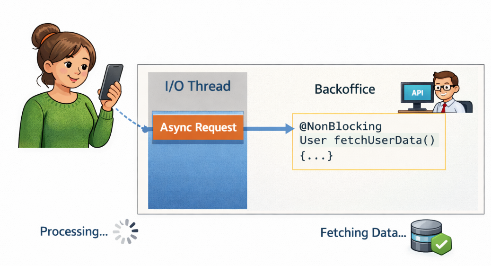
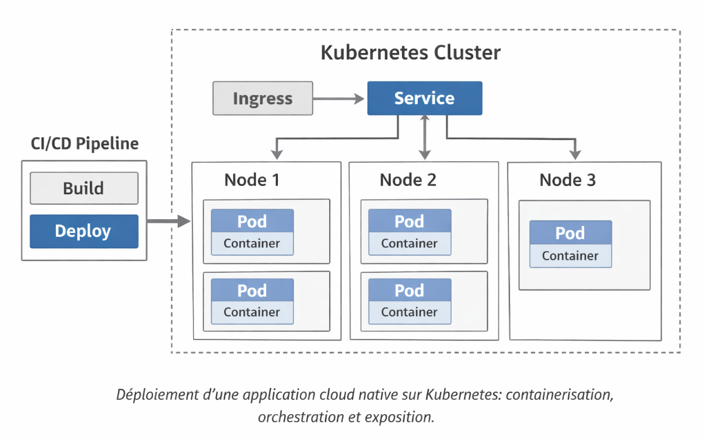

= Adoption de Quarkus après Spring Boot
:page-navtitle: Spring Boot vs Quarkus : comprendre les vrais impacts en projet
:page-excerpt: Retour terrain sur les différences entre Spring Boot et Quarkus : build-time, CDI, performance, natif et impacts concrets sur l’architecture et le développement.
:layout: post
:author: mohamedgdoura
:page-tags: [Java, Spring Boot, Quarkus, CDI, GraalVM, Microservices, Architecture, Performance, Backend]
:docinfo: shared-footer
:page-vignette: images/quarkus/quarkus-vs-spring2.png
:page-liquid:
:showtitle:
:page-categories: architecture

[.text-center]

== Introduction 

Dans beaucoup de projets Java, la question du choix de framework ne se pose plus de manière théorique, mais intervient à un moment clé du cycle projet : lancement d’un nouveau service, refonte partielle ou besoin d’améliorer certaines limites existantes.

C’est souvent dans ce contexte que la comparaison entre Spring Boot et Quarkus apparaît...

Spring Boot est aujourd’hui largement installé dans les systèmes d’information. Il est bien maîtrisé, stable et bénéficie d’un écosystème très riche, ce qui en fait un choix rassurant dans la majorité des cas.

Quarkus, de son côté, propose une approche différente, plus récente, orientée cloud natif. Il ne cherche pas seulement à améliorer les performances, mais surtout à rendre le comportement de l’application plus prévisible (moins d’implicite, moins d’effets de bord au runtime).

Mais réduire la comparaison à ces aspects serait passer à côté de l’essentiel!

La différence entre ces deux frameworks ne se limite pas à des performances ou à des choix techniques. Elle repose sur une manière différente de concevoir une application :

- Ce qui est validé au moment du build ou à l'exécution  

- Le niveau de tolérance aux incohérences  

- La place laissée à l'implicite dans le code et dans la configuration

Autrement dit, ce choix a un impact direct sur la stabilité du système, la lisibilité du code, la capacité à diagnostiquer les problèmes et, à long terme, le coût des incidents en production.

L’objectif de cet article est de clarifier ces différences de manière concrète, avec un regard à la fois développeur et architecture, afin de comprendre dans quels contextes chaque approche est pertinente et ce qu’elle implique réellement en termes de conception, de développement et d’exploitation.

== Quarkus : un modèle orienté build-time et cloud natif

Spring Boot est aujourd’hui le framework Java le plus utilisé pour construire des applications backend. Il repose sur un modèle très flexible, fortement basé sur l’auto-configuration et des mécanismes runtime, ce qui permet de démarrer rapidement et d’intégrer facilement de nombreuses briques.

Quarkus, de son côté, propose une approche différente.
Son nom vient de "quark" (particule élémentaire, très légère) et "us" (les développeurs) : l’idée n’est pas seulement de rendre Java plus léger, mais de remettre le développeur au centre avec un modèle plus explicite et maîtrisé.

Contrairement à Spring Boot, Quarkus ne cherche pas à masquer la complexité, mais à la déplacer et la traiter plus tôt, dès la phase de build.

Le principe central est simple :
réduire au maximum ce qui se passe au runtime pour rendre le comportement de l’application plus prévisible.

Concrètement, cela signifie que : les injections + la configuration + les intégrations (REST, persistance, sécurité…), sont en grande partie analysées et validées au build, plutôt qu’à l’exécution.

Cette approche repose sur le build-time processing, qui permet de :

- limiter fortement la réflexion dynamique
- éviter les scans coûteux au démarrage
- détecter les incohérences très tôt (fail fast)

Résultat : moins de runtime, donc moins d’incertitude et moins d’effets de bord en production.

Quarkus ne remplace pas l’écosystème Java existant. Il s’appuie au contraire sur des standards connus :

- `CDI` pour l’injection
- `JAX-RS` pour le REST
- `Hibernate` pour la persistance
- `MicroProfile` pour les aspects cloud

Mais il les réorganise autour d’un modèle optimisé build-time, plus adapté aux environnements modernes.

Ce fonctionnement repose sur un système d’extensions : chaque extension prépare à l’avance une partie du comportement de l’application (configuration, wiring, intégration), ce qui réduit le travail au runtime.

C’est aussi ce qui rend Quarkus particulièrement adapté à GraalVM : moins de réflexion dynamique signifie une compilation native plus simple et plus efficace.

Enfin, Quarkus est conçu dès le départ pour fonctionner dans des environnements cloud :

- génération de manifests Kubernetes
- health checks, metrics, tracing
- configuration externalisée

Spring est cloud-compatible. Quarkus est cloud-native par conception.

== Build-time vs runtime : une différence qui change vraiment le quotidien

Dans beaucoup de comparaisons entre Spring Boot et Quarkus, on parle de performance ou de cloud native.  
Mais sur le terrain, la différence la plus impactante est ailleurs : *le moment où les erreurs deviennent visibles*.

=== Une philosophie différente

Spring Boot repose largement sur le runtime.  
Grâce à l’auto-configuration, au classpath scanning et aux mécanismes implicites, une application peut démarrer même si certaines parties sont incomplètes ou ambiguës.

Quarkus adopte une approche opposée en déplaçant un maximum de vérifications au moment du build :

* injection (CDI / ArC)
* configuration
* wiring des composants
* intégrations (REST, JPA, sécurité)

Ces validations s’appuient sur des mécanismes comme :

* indexation des classes (remplace le scanning dynamique)
* génération de bytecode au build
* réduction de la reflection

Conséquence directe :

* Spring valide tard, au runtime
* Quarkus valide tôt, au build

Cela change complètement la dynamique du système.

---

=== Exemple concret

[source,java]
----
// ===== Spring Boot =====
@Service
public class PaymentServiceV1 {}

@Service
public class PaymentServiceV2 {}

@Autowired
private PaymentService service;

// L'application démarre
// erreur possible au runtime

// ===== Quarkus =====
@ApplicationScoped
@Named("v1")
public class PaymentServiceV1 {}

@ApplicationScoped
@Named("v2")
public class PaymentServiceV2 {}

@Inject
PaymentService service;

// Build error immédiate : ambiguïté
----

Comparaison directe :

* Spring accepte l’ambiguïté et la gère tard
* Quarkus bloque immédiatement et impose une correction

---

=== Types d’erreurs concernées

Ce comportement ne se limite pas à l’injection :

[cols="1,1"]
|===
|Spring Boot |Quarkus

|Configuration manquante tolérée |Erreur au build
|Datasource mal définie détectée tard |Erreur immédiate
|Mapping JPA invalide runtime |Validation au build
|Bean manquant parfois implicite |Blocage explicite
|===

Spring reporte, Quarkus anticipe.

---

=== Impact sur le développement

Le cycle de développement est directement impacté.

[cols="1,1"]
|===
|Spring Boot |Quarkus

|Debug souvent tardif |Debug anticipé
|Erreurs en intégration ou prod |Erreurs dès le build
|Investigation complexe |Correction localisée
|Feedback progressif |Feedback immédiat
|===

En pratique :

* Spring peut masquer des problèmes jusqu’à un cas réel
* Quarkus expose les incohérences immédiatement

---

=== Impact côté architecture

Les effets dépassent le code et touchent l’architecture.

[cols="1,1"]
|===
|Spring Boot |Quarkus

|Comportement dépendant du contexte |Comportement déterministe
|Forte dépendance runtime |Logique déplacée au build
|Écarts possibles entre environnements |Cohérence renforcée
|Usage important de reflection |Reflection limitée
|===

Quarkus réduit :

* les comportements implicites
* les résolutions dynamiques tardives
* les surprises liées à l’environnement

---

=== Impact runtime

Le modèle influence directement l’exécution.

[cols="1,1"]
|===
|Spring Boot |Quarkus

|Runtime plus riche |Runtime minimal
|Initialisation au démarrage |Préparation au build
|Consommation mémoire plus élevée |Empreinte réduite
|Démarrage plus lent |Démarrage rapide
|===

Quarkus exécute moins de logique au runtime car elle a déjà été résolue au build.

---

=== Modèle de programmation

Les deux approches diffèrent aussi dans le modèle de programmation.

[cols="1,1"]
|===
|Spring Boot |Quarkus

|Majoritairement impératif |Impératif + réactif + virtual threads
|Reactive séparé (WebFlux) |Reactive intégré nativement
|Transition parfois complexe |Adoption progressive
|===

Quarkus permet d’adapter le modèle selon le besoin sans rupture.

---

=== Expérience développeur

Le feedback loop est également différent.

[cols="1,1"]
|===
|Spring Boot |Quarkus

|Redémarrages fréquents |Hot reload rapide
|Feedback plus lent |Feedback immédiat
|Cycle de dev plus long |Cycle court
|===

Cela a un impact direct sur :

* la productivité
* la rapidité d’itération
* la compréhension du système

---

=== Synthèse

[cols="1,1,1", options="header"]
|===
|Aspect |Quarkus |Spring Boot

|Validation |Build-time |Runtime
|Gestion des erreurs |Immédiate |Parfois tardive
|Auto-configuration |Contrôlée |Très forte
|Tolérance |Faible |Élevée
|Feedback dev |Rapide et déterministe |Progressif
|Risque production |Réduit |Plus élevé
|Comportement |Prévisible |Parfois implicite
|Runtime |Minimal |Plus chargé
|===

Le point clé n’est pas uniquement la performance.

C’est le changement de modèle :

* Spring privilégie la flexibilité
* Quarkus privilégie la prévisibilité

En pratique :

* moins d’effets de bord
* moins de bugs tardifs
* meilleure maîtrise du système

== Fail Fast : là ou Quarkus change vraiment la donne 

C’est probablement le point le plus concret quand on passe de Spring Boot à Quarkus. 

Avec Spring, on peut démarrer une application même si tout n’est pas parfaitement carré. Certaines erreurs passent sous le radar au début et apparaissent plus tard, parfois en test, parfois en production. 

Avec Quarkus, ce n’est pas le cas. Si quelque chose ne va pas, l’application ne démarre pas. 

Concrètement, plusieurs situations très simples peuvent bloquer immédiatement le démarrage : une injection ambiguë, un bean manquant, une configuration invalide ou encore un mapping JPA incohérent. Dans ce modèle, il n’y a pas de tolérance temporaire ni de comportement implicite. 

C’est plus strict au départ, mais aussi beaucoup plus lisible. Les problèmes sont visibles immédiatement, dans un contexte maîtrisé, au lieu d’apparaître plus tard de manière parfois difficile à diagnostiquer. 

_Exemple rapide_ 

Injection ambiguë : 
[source,java]
----
@ApplicationScoped 

@Named("v1") 

public class InvoiceServiceV1 {} 

  

@ApplicationScoped 

@Named("v2") 

public class InvoiceServiceV2 {} 

@Inject 

InvoiceService service; //  Quarkus refuse 

Correction : 

@Inject 

@Named("v1") 

InvoiceService service; 
----
 

C'est simple mais obligatoire; e que ça change vraiment 

Au début : 

- On a plus d'erreurs 

- On passe du temps à corriger les détails 

- Ça peut être frustrant 

Mais assez vite, le code devient plus clair et les dépendances vraiment explicites, ce qui permet de mieux comprendre le comportement de l’application et de corriger les problèmes au bon moment, directement pendant le développement, au lieu de les découvrir plus tard dans des situations plus complexes. 

  

La différence avec Spring est assez nette, car Spring a tendance à tolérer et à compenser certaines incohérences, ce qui peut repousser leur détection, alors que Quarkus impose une cohérence immédiate, sans rien masquer, avec une règle simple : si ce n’est pas correctement défini, l’application ne démarre pas. 

  

Côté équipe, le fail fast demande un minimum de rigueur dès le départ, sinon cela peut créer des blocages et de l’incompréhension, mais avec des pratiques propres et un cadre clair, cela devient rapidement un vrai levier pour améliorer la qualité et éviter des problèmes plus coûteux par la suite. 

== Injection des dépendances : CDI VS modèle spring 

La différence entre spring-boot et quarkus devient rapidement visible sur la gestion des dépendances en fait Spring repose sur une résolution au runtime, avec beaucoup d'auto configuration. cela permet de démarrer rapidement avec peu de code explicite. Dans la majorité des cas, le framework choisit automatiquement le bon bean, ou propose des mécanismes comme @Primary ou @Qualifier pour orienter le choix. 

Quarkus adopte une approche plus stricte. L'injection est basée sur CDI et surtout validée ou build time. Toute ambiguïté est considéré comme une erreur. Si plusieurs implémentations correspondent et qu'aucune indication n’est donnée, l'application ne démarre pas! 
Le modèle CDI utilisé par Quarkus est basé sur une spécification standard Java (Jakarta CDI), contrairement au modèle Spring qui est propre à son écosystème. Cela rend l’approche plus portable et plus alignée avec les standards.
Le modèle CDI n’est pas plus complexe que Spring, mais il est beaucoup moins tolérant. Là où Spring compense certaines incohérences, Quarkus les expose immédiatement. 

Cette différence paraît mineure au début, mais elle a un impact direct sur la lisibilité et la robustesse du code. 

Ce que ça change en pratique : 

- les dépendances doivent être explicitement définies 

- les cas ambigus sont traités immédiatement 

- le graphe de dépendances est plus lisible 

  

À l’inverse, un modèle plus implicite peut masquer des comportements, surtout quand le projet grossit. 

_Exemple CDI (Quarkus)_
[source,java]
----
@ApplicationScoped // bean CDI géré par Quarkus 

class InvoiceService {  

    String process() { 

        return "OK"; 

    }  

}  

@Path("/test") // endpoint REST 

class InvoiceResource {  

    @Inject // injection automatique du bean 

    InvoiceService service;  

    @GET 

    public String test() { 

        return service.process(); // appel du service injecté 

    }  

} 
----
*Comparaison rapide*
[cols="1,1,1", options="header"]
|===
|Point |Spring Boot |Quarkus

|Résolution |Runtime |Build-time
|Gestion des conflits |Souvent implicite |Toujours explicite
|Tolérance |Élevée |Faible
|Lisibilité des dépendances |Variable |Élevée
|Détection des erreurs |Parfois tardive |Immédiate
|===

*Lecture architecture*

Spring privilégie la flexibilité et la rapidité de mise en place, quitte à masquer certaines complexités. Quarkus adopte une approche plus stricte, mais aussi plus déterministe, où chaque dépendance et chaque comportement sont clairement définis. 

Sur un projet simple, l’écart reste limité. Mais dès que le système devient plus complexe, cette différence a un impact direct :  

- la compréhension globale est plus facile 

- le debug devient plus rapide 

- la stabilité du système s’améliore 

== Persistance : Panache vs Hibernate 

Sur la persistance, Quarkus et Spring Boot utilisent tous les deux Hibernate/JPA. La vraie différence ne vient pas du moteur, mais de la façon de l’utiliser.  

Spring Boot reste sur une approche classique, souvent avec Spring Data JPA. C’est structuré, connu, et très flexible, mais ça implique plusieurs couches et un peu de boilerplate. 

Quarkus propose Panache, qui simplifie fortement tout ça. L’idée est simple : réduire le code au minimum pour les cas courants. 

Panache supporte également plusieurs modèles : `active record`, `repository pattern` et même des approches adaptées aux bases NoSQL comme MongoDB.

Quarkus propose aussi une version réactive avec Hibernate Reactive, permettant d’adapter la persistance au modèle non bloquant.
 

*Approche classique Vs Panache*

[source,java]
----
// *** Hibernate / Spring style ***
@Entity 

class Invoice {  

    @Id 

    @GeneratedValue 

    Long id;  

    String number; 

}  

interface InvoiceRepository extends JpaRepository<Invoice, Long> {} 

  

class InvoiceService {  

    InvoiceRepository repo;  

    List<Invoice> getAll() { 

        return repo.findAll(); // appel via repository 

    } 

}  

// *** Quarkus Panache *** 

@Entity 

class InvoicePanache extends PanacheEntity {  

    public String number;  

    static List<InvoicePanache> getAll() { 

        return listAll(); // accès direct    } 

} 
----
Dans le premier cas, on passe par une couche repository, tandis que dans le second, l’accès aux données se fait directement depuis l’entité. 

 

Ce que Panache apporte : 

- Moins de boilerplate 

- code plus court  

- accès direct aux opérations courantes 

C’est particulièrement efficace pour des CRUD simples, des services légers ou des microservices. 

*Là où il faut faire attention*

Panache pousse naturellement vers un modèle de type active record. Sans discipline, on mélange rapidement la logique métier, l’accès aux données et le modèle, ce qui peut rendre le code difficile à maintenir. 

 

*Comparaison Panache versus Hibernate classique*
[cols="1,1,1", options="header"]
|===
|Critère |Panache |Hibernate classique

|Quantité de code |Très faible |Plus verbeux
|Simplicité |Élevée |Moyenne
|Flexibilité |Limitée |Très élevée
|Séparation des responsabilités |Faible si mal utilisé |Meilleure
|Cas complexes |Moins adapté |Adapté
|===

*Bon usage*

Panache fonctionne bien si on garde une discipline simple : 

- L’utiliser pour les opérations simples 

- Éviter de mettre toute la logique métier dans l'entité  

- Garder une couche service claire 

Pour des besoins plus complexes (requêtes avancées, logique métier riche), une approche plus classique avec repository reste plus adaptée. 

*Lecture architecture*

La différence est surtout structurelle. Panache permet d’aller très vite sur les cas simples, alors que l’approche classique reste plus solide dès que le modèle devient riche. 

  

En résumé, Panache favorise la simplicité et la rapidité, tandis que Hibernate classique apporte plus de contrôle et de robustesse. 

 

== Modèle d’exécution : bloquant vs non bloquant 

Quand on parle de performance avec quoi Quarkus on pense souvent au démarrage ou à la mémoire en réalité une grande partie des gains vient du modèle d'exécution basé sur Vert.x. 

Contrairement à Spring boot (mode classique MVC), Quarkus peut traiter certaines requêtes sur des threads dites I/O, conçu peut être rapide et non bloquants. 

Dans un modèle classique, chaque requête utilise un thread qui reste bloqué en attendant les appels, tandis qu’avec Quarkus, un petit nombre de threads I/O non bloquants permet un traitement asynchrone où un même thread peut gérer plusieurs requêtes. 
Ce modèle repose sur le moteur réactif de Quarkus et l’API Mutiny, qui permet de manipuler des flux asynchrones de manière lisible et composable.

Il permet également de connecter du code impératif classique avec du code réactif, ce qui facilite les transitions progressives sans réécriture complète.

_Exemple simple_

*Code non bloquant :*
[source,java]
----

// ===== NON BLOQUANT ===== 

@GET 

@NonBlocking 

public Uni<String> hello() { 

    return Uni.createFrom().item("ok"); 

}  

// ===== INCORRECT (bloquant) ===== 

@GET 

@NonBlocking 

public Uni<String> hello() { 

    Thread.sleep(1000); // bloque le thread I/O 

    return Uni.createFrom().item("ok"); 

}
----
Ici, le traitement reste sur un thread I/O, mais dès qu’on introduit une opération bloquante, on casse complètement le modèle, ce qui entraîne rapidement de la latence, une saturation des threads et une perte de performance ; la règle est simple, un thread I/O ne doit jamais être bloqué, et pour les traitements bloquants comme JPA classique, Quarkus bascule sur des worker threads. 

*Comparaison rapide*
[cols="1,1,1", options="header"]
|===
|Aspect |Spring Boot (MVC) |Quarkus

|Modèle |Bloquant |Non bloquant + réactif
|Gestion des threads |1 thread / requête |Pool réduit
|Scalabilité |Limitée par threads |Meilleure
|Complexité |Faible |Plus exigeante
|Risque |Thread saturation |Mauvais usage du non-bloquant
|===
Le piège classique est d’écrire du code bloquant en pensant être non bloquant, comme des accès base synchrones, des appels REST bloquants ou des traitements lourds dans les endpoints, ce qui annule les bénéfices de Quarkus ; le bon usage consiste à garder le non bloquant pour les I/O, isoler le bloquant et comprendre où le code s’exécute, car ce modèle est plus puissant mais aussi plus exigeant. 

 

GraalVM et compilation native : promesse vs réalité 

Quand en parle de Quarkus, GraalVM revient très vite à la discussion. L'idée est simple : compiler une application Java en binaire natif plutôt que le faire tourner sur la JVM. 

Sur le papier, les avantages sont clairs : un démarrage quasi instantané, une consommation mémoire réduite et une excellente adaptation aux environnements conteneurisés, ce qui rend Quarkus particulièrement pertinent pour des microservices, des fonctions serverless ou des workloads éphémères. 

*Ce que ça change concrètement*

Avec une application classique sur la JVM, le démarrage est plus lent, la consommation mémoire plus élevée et le comportement reste très dynamique, alors qu’une application native démarre presque instantanément, consomme beaucoup moins de mémoire et adopte un comportement plus figé, car tout est en grande partie pré-calculé au moment du build. 

*Le lien avec Quarkus*

Quarkus est conçu pour ça. Son approche build-time permet d’éviter la réflexion dynamique, de préparer les métadonnées à l’avance et de réduire le travail au runtime. C’est ce qui le rend particulièrement efficace en natif. 

_Exemple simple_
[source,java]
----
Build JVM classique 

./mvnw clean package 

Build natif (avec GraalVM) 

./mvnw package -Dnative 

Exécution JVM 

java -jar target/app-runner.jar 

Exécution native 

./target/app-runner 
----

Une application JVM reste plus flexible et tolérante, tandis qu’une application native est plus rapide et plus légère mais demande davantage d’anticipation, car le passage en natif n’est pas automatique et certaines parties dynamiques comme la réflexion ou certaines librairies doivent être adaptées ; au final, GraalVM apporte un vrai gain en démarrage et en mémoire, et Quarkus est optimisé pour en tirer parti, mais cela reste un choix d’optimisation à aligner avec le contexte du projet. 

 
== Modèle d’exécution : bloquant vs non bloquant 

Quand on parle de performance avec Quarkus, on pense souvent au démarrage ou à la mémoire. En réalité, une grande partie des gains vient du modèle d’exécution basé sur Vert.x. 

Contrairement à Spring Boot (mode classique MVC), Quarkus peut traiter certaines requêtes sur des threads dits I/O, conçus pour être rapides et non bloquants. 

Dans un modèle classique, chaque requête utilise un thread qui reste bloqué en attendant les appels. Avec Quarkus, un petit nombre de threads I/O non bloquants permet un traitement asynchrone, où un même thread peut gérer plusieurs requêtes. 

_Exemple simple_

*Code non bloquant :*
[source,java]
----
// ===== NON BLOQUANT ===== 
@GET
@NonBlocking
public Uni<String> hello() {
    return Uni.createFrom().item("ok");
}

// ===== INCORRECT (bloquant) ===== 
@GET
@NonBlocking
public Uni<String> hello() {
    Thread.sleep(1000); // bloque le thread I/O
    return Uni.createFrom().item("ok");
}
----

Dans ce modèle, une méthode annotée `@NonBlocking` est exécutée directement sur un thread I/O. Cela évite les changements de thread et améliore les performances. 

Mais il y a une règle stricte : un thread I/O ne doit jamais être bloqué. Introduire une opération bloquante à cet endroit (comme un `Thread.sleep`, un appel base de données synchrone ou un appel REST bloquant) casse complètement le modèle. 

Les conséquences sont immédiates : latence globale, saturation des threads et dégradation de l’ensemble de l’application. 

Pour les traitements bloquants (comme JPA classique), Quarkus bascule automatiquement sur des worker threads. Mais cela suppose de bien comprendre où s’exécute le code. 

La performance de Quarkus ne vient donc pas uniquement du framework, mais du respect de ce modèle. Une mauvaise utilisation peut annuler complètement les gains attendus. 

*Comparaison rapide*
[cols="1,1,1", options="header"]
|===
|Aspect |Spring Boot (MVC) |Quarkus

|Modèle |Bloquant |Non bloquant + réactif
|Gestion des threads |1 thread / requête |Pool réduit (I/O + worker)
|Scalabilité |Limitée par threads |Meilleure
|Complexité |Faible |Plus exigeante
|Risque |Saturation des threads |Mauvais usage du non-bloquant
|===

Le piège classique est d’écrire du code bloquant en pensant être non bloquant, comme des accès base synchrones, des appels REST bloquants ou des traitements lourds dans les endpoints. Cela annule complètement les bénéfices de Quarkus. 

Le bon usage consiste à garder le non bloquant pour les opérations I/O, isoler le bloquant et comprendre précisément où le code s’exécute. Ce modèle est plus puissant, mais aussi plus exigeant. 

== GraalVM et compilation native : promesse vs réalité 

Quand on parle de Quarkus, GraalVM revient très vite dans la discussion. L’idée est simple : compiler une application Java en binaire natif plutôt que de la faire tourner sur la JVM. 

Sur le papier, les avantages sont clairs : démarrage quasi instantané, consommation mémoire réduite et meilleure adaptation aux environnements conteneurisés. Cela rend Quarkus particulièrement pertinent pour des microservices, des fonctions serverless ou des workloads éphémères. 
Cependant, le choix entre JVM et natif dépend fortement du contexte : les applications longues durées ou nécessitant beaucoup de dynamisme restent souvent plus adaptées à la JVM, tandis que les microservices ou workloads éphémères bénéficient pleinement du mode natif.

*Ce que ça change concrètement*

Avec une application JVM classique, le démarrage est plus lent, la mémoire plus élevée et le comportement dynamique. À l’inverse, une application native démarre presque instantanément, consomme moins de mémoire et adopte un comportement plus figé, car une grande partie du travail est effectuée au moment du build. 

*Le lien avec Quarkus*

Quarkus est conçu pour ce modèle. Son approche build-time permet de limiter la réflexion dynamique, de préparer les métadonnées à l’avance et de réduire le travail au runtime. C’est ce qui le rend particulièrement efficace en mode natif. 

_Exemple simple_
[source,bash]
----
# Build JVM classique
./mvnw clean package

# Build natif (avec GraalVM)
./mvnw package -Dnative

# Exécution JVM
java -jar target/app-runner.jar

# Exécution native
./target/app-runner
----

Une application JVM reste plus flexible et tolérante. Une application native est plus rapide et plus légère, mais demande davantage d’anticipation. Certaines fonctionnalités dynamiques (réflexion, proxies, certaines librairies) doivent être adaptées. 

GraalVM apporte donc un vrai gain en démarrage et en mémoire, et Quarkus est optimisé pour en tirer parti. Mais ce n’est pas un mode automatique : c’est un choix d’optimisation à aligner avec le contexte du projet. 

== Sécurité : stateless vs modèle Spring Security 

La sécurité est souvent un point décisif dans le choix d’un framework. Entre Spring Boot et Quarkus, la différence tient surtout à l’approche. 

Spring Security propose un écosystème très complet, capable de couvrir des cas variés comme l’authentification, l’autorisation, la gestion de session, OAuth2 ou LDAP. Cette richesse offre une grande flexibilité, mais peut rendre la configuration plus complexe à maintenir. 

Quarkus privilégie une approche plus simple et moderne, orientée stateless. La sécurité repose principalement sur des tokens (JWT) validés à chaque requête, sans état côté serveur. Ce modèle simplifie l’architecture, améliore la scalabilité et s’intègre naturellement dans des architectures microservices avec un fournisseur d’identité externe. 
Quarkus facilite aussi les tests de sécurité en phase de développement grâce aux Dev Services, qui permettent de lancer automatiquement un provider OIDC (comme Keycloak) sans configuration complexe.
_Exemple code_ 

[source,java]
----
// ===== Spring Security (classique) ===== 
@EnableWebSecurity
class SecurityConfig {  
    protected void configure(HttpSecurity http) throws Exception { 
        http
            .authorizeRequests()
            .anyRequest().authenticated()
            .and()
            .formLogin(); // session côté serveur
    } 
}  

// ===== Quarkus (JWT / stateless) ===== 
@RolesAllowed("admin")
@GET
@Path("/secure")
public String secure() {
    return "ok"; // vérification via token
}
----

*Comparaison*
[cols="1,1,1", options="header"]
|===
|Aspect |Spring Boot |Quarkus

|Modèle |Stateful ou Stateless |Stateless (par défaut)
|Authentification |Session / JWT / OAuth2 |JWT / OIDC
|État serveur |Possible |Aucun
|Configuration |Riche, centralisée |Plus directe
|Complexité |Élevée |Modérée
|Scalabilité |Bonne |Très bonne
|===

Le passage à un modèle stateless implique une dépendance plus forte au système d’identité, une gestion des tokens côté client et leur propagation entre services. En contrepartie, il améliore la scalabilité et simplifie l’architecture globale. 

Spring Security reste incontournable pour des applications legacy ou des besoins très spécifiques. Quarkus est plus adapté lorsque l’architecture est orientée microservices et que l’authentification est externalisée. 

Au final, Spring Security est extrêmement complet mais parfois lourd à configurer, tandis que Quarkus privilégie la simplicité et le stateless. Le choix dépend avant tout du contexte et de l’architecture cible. 
 

== Résilience et fault tolérance : le sujet qu’on sous-estime souvent 

On parle souvent de performance, de non-bloquant ou de natif avec Quarkus, mais dans les projets réels, le vrai sujet n’est pas le temps de démarrage. Ce sont les pannes : services externes indisponibles 

- Latence réseau 

- Timeouts 

- Erreurs intermittentes 

C’est là que la résilience devient un enjeu central. 

*Approche Quarkus*

Quarkus s’appuie sur les spécifications MicroProfile, notamment Fault Tolerance. 
Cette approche s’intègre avec d’autres briques MicroProfile comme les health checks, les métriques (Micrometer) et le tracing (OpenTelemetry), permettant une observabilité complète du système.

Le principe est simple : déclarer le comportement attendu en cas de problème directement dans le code. 

 _Exemple :_ 
[source,java]
----
@Retry(maxRetries = 3) 

@Timeout(200) 

@Fallback(fallbackMethod = "fallback") 

public String callExternalService() { 

    return client.call(); 

}  

public String fallback() { 

    return "default"; 

} 
----
 

*Approche Spring*

Dans Spring Boot, ces problématiques sont généralement adressées via des librairies comme Resilience4j. Cela implique souvent une configuration externe, l’usage d’annotations et de beans, avec une intégration parfois plus indirecte. Le résultat est efficace, mais reste moins standardisé au cœur du framework. 

_Ce que ça change en pratique_

La fault tolerance n’est pas un détail : sans elle, un appel externe peut bloquer toute une chaîne, une erreur se propager et rendre un service indisponible ; avec elle, les erreurs sont contenues, le système reste stable et les comportements deviennent maîtrisés. 

_Différence de philosophie_

Quarkus pousse à intégrer la résilience directement dans le code, de manière déclarative et standardisée, tandis que Spring Boot offre plus de liberté mais demande généralement davantage de configuration et de structuration. En pratique, ce sujet est largement sous-estimé : on implémente d’abord le REST, la sécurité ou l’accès aux données, et la gestion des pannes arrive tard, souvent trop tard. Or, en production, la fault tolerance est indispensable ; Quarkus propose une approche intégrée et cohérente, là où Spring nécessite souvent l’ajout de briques complémentaires. Ce n’est pas le sujet le plus visible, mais c’est clairement l’un des plus critiques. 

 

== Écosystème et intégration : le vrai facteur de choix 

Dans la pratique, le choix entre Spring Boot et Quarkus ne se fait pas uniquement sur la performance ou le modèle d’exécution, mais surtout sur l’écosystème et la capacité d’intégration : Spring Boot bénéficie d’un écosystème extrêmement large et mature avec des modules couvrant la plupart des besoins (data, sécurité, messaging, cloud, batch), ce qui permet dans beaucoup de cas de trouver directement une solution prête à l’emploi, alors que Quarkus propose un modèle basé sur des extensions, plus ciblé et cohérent, optimisé pour le build-time et le natif, très efficace sur les cas standards mais parfois plus limité dès que les besoins deviennent spécifiques ou liés à des systèmes existants. 
Chaque extension Quarkus encapsule une intégration optimisée (Kafka, REST, sécurité…), préparée au build-time pour réduire le coût au runtime.

Le projet Quarkiverse complète cet écosystème avec des extensions communautaires couvrant des cas d’usage supplémentaires.

Exemple concret 

[source,java]
----
// ===== Spring Boot : intégration via starter ===== 

@Configuration 

class KafkaConfig { 

    // auto-configuration Spring Boot 

    // dépendance ajoutée → Kafka prêt à l'emploi 

}  

// ===== Quarkus : extension dédiée ===== 

@Incoming("orders") 

public void consume(String message) { 

    // traitement Kafka via extension Quarkus 

} 
----

Spring privilégie une intégration rapide via des starters prêts à l’emploi, tandis que Quarkus repose sur des extensions plus ciblées et optimisées. 

*Comparaison*
[cols="1,1,1", options="header"]
|===
|Aspect |Spring Boot |Quarkus

|Richesse de l’écosystème |Très élevée |Moyenne
|Intégrations disponibles |Très nombreuses |Ciblées
|Maturité des modules |Très mature |Variable
|Cas spécifiques / legacy |Très bien couverts |Plus limités
|Cohérence globale |Variable |Très cohérente
|===

== Cloud native et Kubernetes : un point structurant
Quarkus est conçu dès le départ pour fonctionner dans des environnements Kubernetes et OpenShift. Comme illustré dans le schéma, l’application est construite via un pipeline CI/CD, puis déployée sous forme de conteneurs exécutés dans des pods au sein d’un cluster Kubernetes. L’exposition se fait via des services et un ingress, permettant de router le trafic vers les différentes instances.

Il permet de générer automatiquement des manifests Kubernetes et de construire des images conteneur optimisées, ce qui simplifie le passage du code au déploiement.

Il s’intègre naturellement avec les pratiques cloud natives : health checks, metrics, tracing et configuration externalisée, visibles à travers les différents niveaux du cluster.

Cela réduit fortement l’effort nécessaire pour passer du développement à la production dans un environnement cloud, en standardisant toute la chaîne, du build jusqu’à l’exécution.

== Migration de Spring Boot vers Quarkus
Migrer de Spring Boot vers Quarkus ne consiste pas à copier le code en changeant quelques annotations.  
C’est adapter le service à un modèle plus explicite, validé au build et moins tolérant au runtime.

Sur le papier, les deux frameworks couvrent les mêmes besoins (REST, injection, persistance, sécurité).  
En pratique, la différence se voit dès les premières lignes de code et au démarrage de l’application.

Spring Boot permet d’avancer rapidement avec beaucoup d’auto-configuration.  
Quarkus impose d’être plus précis dès le départ : dépendances claires, configuration explicite, comportements maîtrisés.

La migration est généralement plus efficace si elle est progressive :
on extrait un service existant, on le reconstruit en Quarkus, puis on valide en conditions réelles.

Les principaux changements à prendre en compte :

- REST : passage de Spring MVC à JAX-RS (@RestController → @Path)  
- Injection : plus d’implicite, toutes les dépendances doivent être définies clairement (CDI)  
- Configuration : moins d’auto-config, validation au build (les erreurs apparaissent immédiatement)  
- Persistance : Hibernate reste, Panache peut simplifier mais ne remplace pas une bonne structuration  
- Exécution : attention au code bloquant, surtout si utilisation du modèle non bloquant (Vert.x)  
- Sécurité : passage d’un modèle session à un modèle stateless (JWT / OIDC)  
- Intégration : moins de starters "magiques", vérifier les équivalents Quarkus  
- Build : possibilité de compilation native (GraalVM), mais plus exigeante  
- Observabilité : Actuator remplacé par MicroProfile (health, metrics, tracing)  

Concrètement, la différence se voit au démarrage :

- une injection ambiguë bloque immédiatement  
- une configuration manquante empêche l’application de démarrer  
- un mapping JPA invalide est détecté plus tôt  

Là où Spring tolère et corrige au runtime, Quarkus refuse et force à corriger immédiatement.

Le piège classique est de reproduire les patterns Spring sans adaptation :
le code fonctionne, mais on perd les bénéfices de Quarkus.

Une migration réussie consiste à adapter le service au modèle Quarkus,
pas à adapter Quarkus au code Spring.

*Correspondance concrète (Spring vs Quarkus)*

[cols="1,1", options="header"]
|===
|Spring Boot |Quarkus

|*REST Controller*
[source,java]
----
@RestController
@RequestMapping("/hello")
public class HelloController {

    @GetMapping
    public String hello() {
        return "ok";
    }
}
----
|*REST Endpoint (JAX-RS)*
[source,java]
----
@Path("/hello")
public class HelloResource {

    @GET
    public String hello() {
        return "ok";
    }
}
----

|*Service*
[source,java]
----
@Service
public class MyService {
}
----
|*Bean CDI*
[source,java]
----
@ApplicationScoped
public class MyService {
}
----

|*Injection*
[source,java]
----
@Autowired
private MyService service;
----
|*Injection CDI*
[source,java]
----
@Inject
MyService service;
----

|*Repository*
[source,java]
----
public interface InvoiceRepository 
    extends JpaRepository<Invoice, Long> {}
----
|*Panache*
[source,java]
----
@Entity
public class Invoice extends PanacheEntity {
}
----

|*Sécurité*
[source,java]
----
http.authorizeRequests()
    .anyRequest().authenticated();
----
|*Sécurité JWT*
[source,java]
----
@RolesAllowed("user")
@GET
@Path("/secure")
public String secure() {
    return "ok";
}
----
|===

== Ce que j’en ai appris

Avec le recul, le choix entre Spring Boot et Quarkus ne se limite pas à un choix de framework, mais reflète une manière différente de concevoir et de maîtriser un système.

Spring Boot privilégie la rapidité de mise en œuvre et la capacité d’intégration. Il permet de démarrer vite, avec beaucoup de mécanismes implicites, ce qui le rend particulièrement efficace dans des environnements riches ou hétérogènes. Cette flexibilité reste un atout majeur, mais elle peut aussi introduire une part d’incertitude, certaines erreurs n’apparaissant qu’à l’exécution.

Quarkus adopte une approche plus stricte et plus explicite. En déplaçant une partie des validations au build et en imposant un modèle fail fast, il force à traiter les incohérences dès le départ. Cela change la dynamique du développement : on passe moins de temps à diagnostiquer des comportements inattendus et plus de temps à construire un système cohérent.

Le principal bénéfice n’est pas tant la performance que la prévisibilité. Le système devient plus lisible, les dépendances sont mieux maîtrisées et le comportement global est plus facile à anticiper, notamment à mesure que l’application évolue.

En contrepartie, cette approche demande davantage de rigueur. Certains concepts, comme le non-bloquant ou la compilation native, nécessitent une bonne compréhension pour être utilisés correctement. Sans cette discipline, les gains peuvent être rapidement annulés.

== Conclusion

Le choix entre Spring Boot et Quarkus est avant tout un choix d’architecture.

Spring Boot reste particulièrement adapté aux systèmes complexes, fortement intégrés ou dépendants d’un écosystème riche. Il offre une grande flexibilité et une couverture fonctionnelle très large, ce qui en fait une solution robuste dans la majorité des contextes.

Quarkus propose une approche plus déterministe, orientée build-time, non bloquante et stateless. Il réduit les comportements implicites et améliore la maîtrise du système, avec des gains en performance et en consommation, à condition de respecter ses contraintes.

En pratique, Spring optimise la capacité d’intégration et la vitesse de mise en œuvre, tandis que Quarkus optimise la lisibilité, la stabilité et le contrôle du comportement à l’exécution.